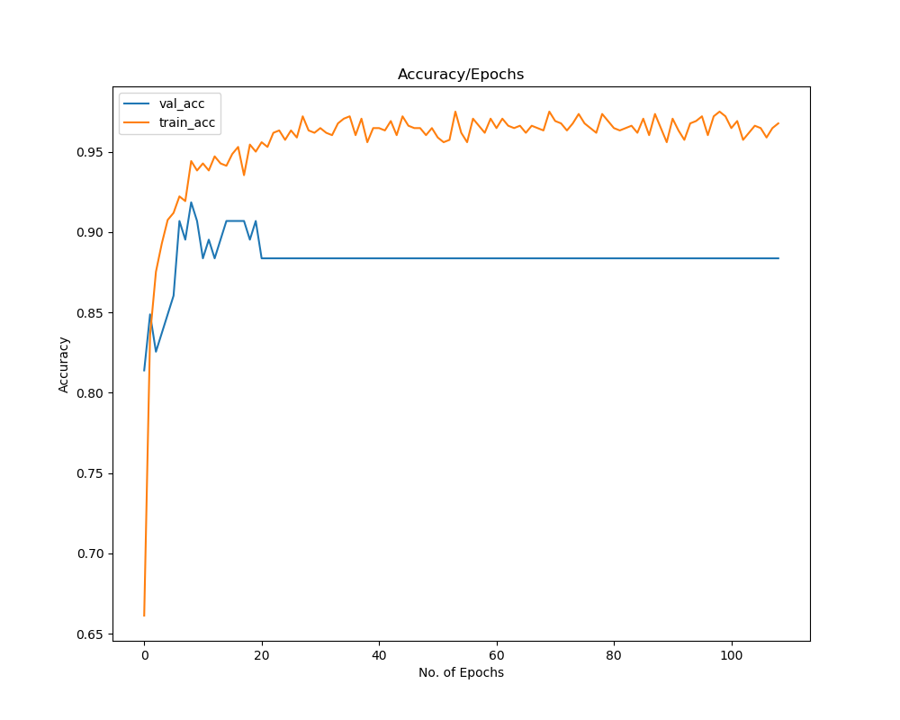
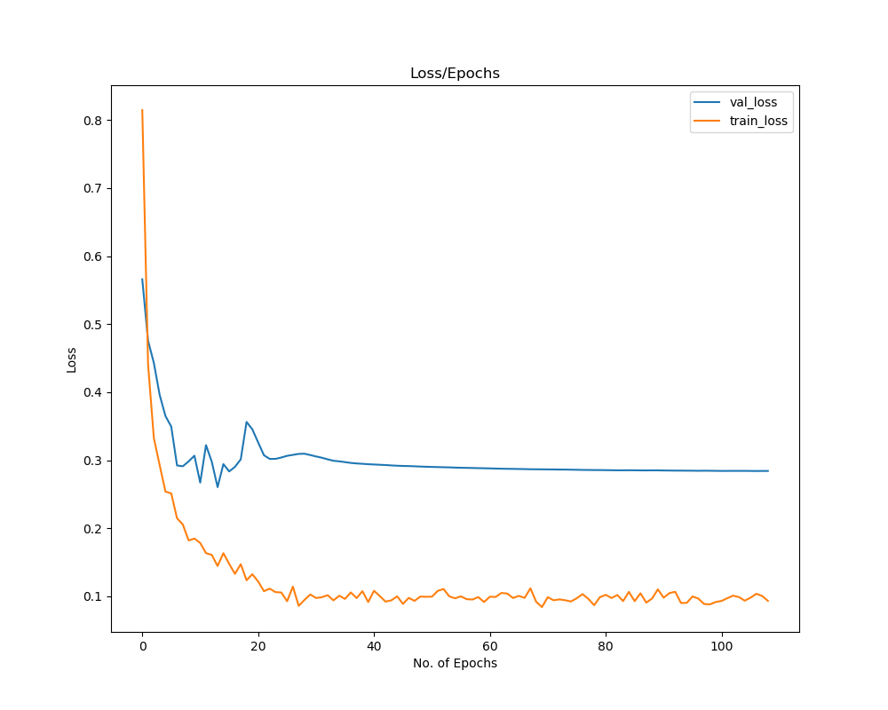
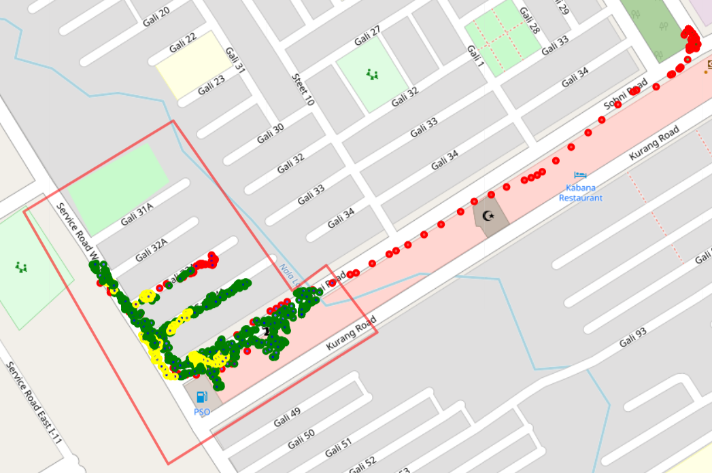
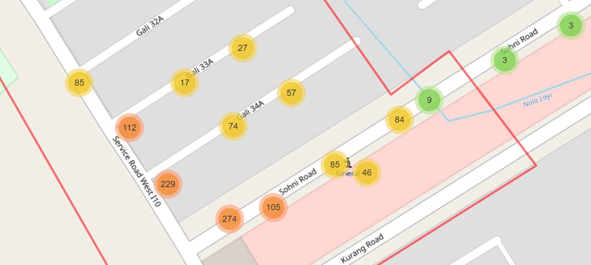

# Picker-and-Cleaning-Work-tracking-system
Deep Learning based approach for Picker and Cleaning Workers performance Measure. 

## Requirements:

pip install --user --requirement requirements.txt

			scikit-learn==0.20.3
			keras==2.2.4
			tensorflow==1.12.0
			fitparse==1.1.0
			pytz==2018.9
			numpy==1.16.4
			pandas==0.24.2
			folium==0.5.0
			shapely==1.6.4.post2
			matplotlib==3.0.3

## For Training:

>python train.py --fp model_name --dp path_to_training_data... --tp path_to_training_labels...

>python train.py --fp CNNLSTM --dp Data_Generation_For_training/Data_total_orignal.npy --tp Data_Generation_For_training/tags_orignal.npy

For Help Write:
	>python train.py -h

	Usage: train.py [options]

	Options:
	  -h, --help            show this help message and exit
	  --model_name=MODEL_NAME, --fp=MODEL_NAME
							Write the model name you want to train.For
							example:MLP,LSTM,CONVLSTM,CNNLSTM
	  --data_path=DATA_PATH, --dp=DATA_PATH
							Path to training data features
	  --tags_path=TAGS_PATH, --tp=TAGS_PATH
							Path to training data labels or tags
	  --verbose=VERBOSE, --vr=VERBOSE
							Display training progress=1, not display=0,default=1
	  --epochs=EPOCHS, --ep=EPOCHS
							No. of epochs for model training,default=1000
	  --batch_size=BATCH_SIZE, --bs=BATCH_SIZE
							Batch size for model training,default=256
	  --Model_Evaluation=MODEL_EVALUATION, --me=MODEL_EVALUATION
							Want to save training loss acc graph, and test score,default=True
	  --Frozen_file=FROZEN_FILE, --fr=FROZEN_FILE
							Want to save pb and pbtxt frozen file,default=False
						

## For Testing:
>python testing.py --fp Fit_file --kp Map_kml_file

>python testing.py --fp excel\Initial_data\G4\GARMIN\ACTIVITY\8CA74139.FIT --kp kml_files/i10_markaz.kml

For Help Write:
	>python testing.py -h

	Usage: testing.py [options]

	Options:
	  -h, --help            show this help message and exit
	  --file_path=FILE_PATH, --fp=FILE_PATH
							Path to Garmin Activity .fit file
	  --kml_path=KML_PATH, --kp=KML_PATH
							Path to Google map generated KML file for area
	  --model_path=MODEL_PATH, --mp=MODEL_PATH
							Path to trained model file,default='MODELS/CNNLSTM.h5
	  --std_path=STANDARD_SCALAR_PATH, --sp=STANDARD_SCALAR_PATH
							Path to saved standard_scalar file,default='MODELS/CNNLSTM_std_scaler.bin
							

After Testing 4 files will be generated for that specific Activity:

	- Fit_File_Data.csv: Fit to csv format activity data
	
	- Map.html: Show the Map of Working Area.
		
		Where circle marker show
		Green Circle Marker: Working
		Red Circle Marker: Not Working (or Outside)
		Yellow Circle Marker: Partially
		

	- Map_Cluster.html: Show where worker spend most of the time.
	

	- summary.txt: summary of daily working of workers, and generate the map to show characterstics.
	
		|	Person Name			|	ABC			|
		|---------------------------------------|-------------------------------|
		|	Activity Start Time		|	07:29:10		|
		|	Activity End Time		|	11:29:34		|
		|	total Activity Time		|	4:00:24			|
		|	Inside Area Total Time		|	3:50:21			|
		|	Inside Area Working Time	|	2:29:59			|
		|	Percentage Area Inside Time	|	95.82%			|
		|	Percentage Area Working Time	|	65.11%			|

